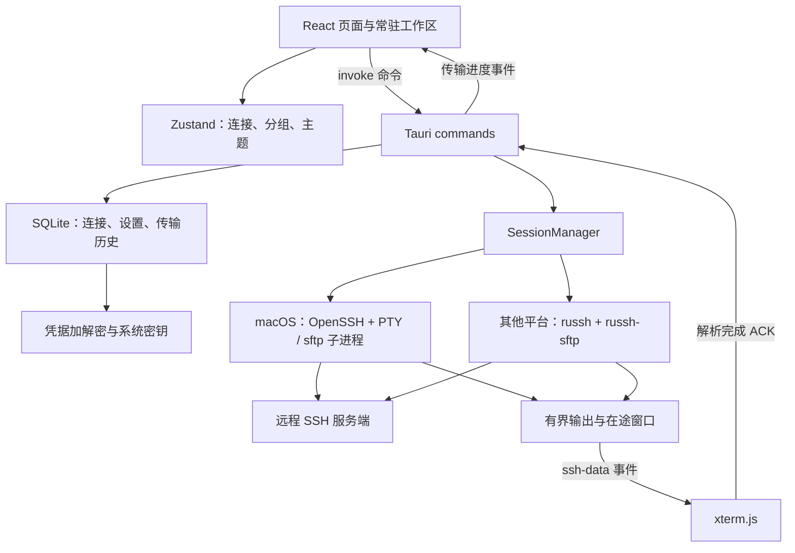

# SSHX 项目详解与性能优化方案

分析日期：2026-09-24。代码基线：`main` 分支、提交 `ba6c503`、版本 `0.5.0`。

本报告基于源码审查、前端测试、生产构建，以及独立内存 SQLite 的查询计划验证。没有运行真实 SSH/SFTP 压测、桌面启动计时或 Rust 全量测试。因此，下文将实现事实与待测收益分开，不给未经测量的提速百分比。本次仅新增分析文档，没有修改业务代码。

**1. 项目定位与架构**

SSHX 是本地优先的桌面 SSH 连接管理器，主要功能包括连接与分组管理、多标签终端、密码/密钥/交互式认证、本地与远程文件浏览、多文件选择与逐文件传输、取消与历史记录、终端主题及诊断日志。应用没有独立的 HTTP 业务服务：React 通过 Tauri IPC 调用本机 Rust，Rust 直接访问 SQLite、系统凭据库和 SSH 服务端。

| 层次 | 当前实现 | 职责与关键位置 |
|---|---|---|
| 桌面外壳 | Tauri 2、系统 WebView | 窗口、插件、命令注册、初始化；[lib.rs](/Users/ushopal/workspace/myself/sshx/src-tauri/src/lib.rs:18) |
| 前端 | React 18、TypeScript、Vite 8、Tailwind、Radix UI | 路由、表单、工作区和交互；[App.tsx](/Users/ushopal/workspace/myself/sshx/src/App.tsx:10) |
| 状态 | Zustand + 组件 state/ref | 全局连接/分组/主题；实际终端实例由页面自己管理；[store/index.ts](/Users/ushopal/workspace/myself/sshx/src/store/index.ts:44) |
| 终端 | xterm.js、FitAddon | 字节解析、终端显示、输入、窗口尺寸；[TerminalPage.tsx](/Users/ushopal/workspace/myself/sshx/src/pages/TerminalPage.tsx:617) |
| SSH 运行时 | Tokio + 分平台适配 | macOS 使用 OpenSSH/PTY；非 macOS 使用 russh；[session/mod.rs](/Users/ushopal/workspace/myself/sshx/src-tauri/src/ssh/session/mod.rs:185) |
| 会话管理 | HashMap + Arc + Tokio Mutex | 按 session ID 路由操作；[manager.rs](/Users/ushopal/workspace/myself/sshx/src-tauri/src/ssh/manager.rs:7) |
| 持久化 | rusqlite/SQLite | 连接、分组、设置、传输历史；[db/mod.rs](/Users/ushopal/workspace/myself/sshx/src-tauri/src/db/mod.rs:11) |
| 凭据 | AES-256-GCM + 系统凭据库 | 数据库存密文，系统凭据库保管随机密钥；备份另用密码派生密钥加密；[credentials.rs](/Users/ushopal/workspace/myself/sshx/src-tauri/src/db/credentials.rs:165) |



终端与文件传输页面不随普通路由切换卸载。[MainLayout.tsx](/Users/ushopal/workspace/myself/sshx/src/components/layout/MainLayout.tsx:45) 使用 CSS 隐藏工作区；[FileTransferWorkspace.tsx](/Users/ushopal/workspace/myself/sshx/src/pages/FileTransferWorkspace.tsx:170) 也保留已打开的传输标签。这保证切换页面时会话和任务持续，但同时要求明确控制隐藏页面的事件处理与资源占用。

macOS 与非 macOS 的优化必须分别验证。前者涉及本地进程、PTY、OpenSSH 控制连接复用和外部命令；后者主要是 Tokio 任务、russh 通道和 SFTP 子系统。不能将某一平台的测试结论直接推广到另一平台。仓库 CI 已包含 macOS、Windows、Linux 构建，而 README 的 Linux 支持路线图仍未勾选，文档状态需要对齐。

**2. 三条主要业务链路**

连接管理：页面调用连接/分组命令 → Rust 获取数据库锁 → SQL 读取或事务更新 → 返回对象 → 更新 Zustand。当前列表查询同时解密密码、私钥路径和私钥口令，详见 [db/connection.rs](/Users/ushopal/workspace/myself/sshx/src-tauri/src/db/connection.rs:18)。多个页面各自加载同一份列表，是后续优化入口。

终端连接：前端创建标签和 session ID、准备 xterm 尺寸、监听认证提示 → `ssh_connect` 按 ID 读取连接并认证 → 注册会话 → 前端安装输出监听并发送 `ssh_output_ready` → Rust 发字节事件 → xterm 处理 → 前端在写入回调内 ACK。键盘输入和尺寸变化通过 `ssh_write`、`ssh_resize` 回到对应会话。核心桥接见 [terminalOutput.ts](/Users/ushopal/workspace/myself/sshx/src/lib/terminalOutput.ts:9)。这里的写入回调表示 xterm 已处理数据，不等于屏幕已完成绘制。

文件传输：传输标签建立会话 → 加载本地/远程目录 → 前端逐个调度选中文件 → Rust 校验路径及目标状态、记录 running 历史 → 分平台执行传输并上报进度 → 成功/失败写入历史终态 → 页面刷新列表与历史。文件字节主要在 Rust/外部 SFTP 进程中流动，前端接收进度和元数据；不需要先把整个文件读入 JavaScript。历史写库集中在开始和结束，并非每个进度块都执行 SQL。

当前实际终端主路径在 TerminalPage；`useSSH.ts`、`useTerminal.ts` 在 `src` 中只有定义、未见调用。`useTerminal` 内虽加载 WebGL addon，实际主路径未使用它，不能因依赖存在就认为 GPU 终端渲染已启用。

**3. 已有性能措施与本次验证结果**

| 已有措施 | 意义 |
|---|---|
| 终端输出最多 16 KiB/块、256 KiB 未确认窗口 | 避免 Rust 向 WebView 无限灌入数据；[session/mod.rs](/Users/ushopal/workspace/myself/sshx/src-tauri/src/ssh/session/mod.rs:9) |
| 前端就绪握手、xterm 写入完成后 ACK、64 KiB/定时累计确认 | 防止首包丢失并控制积压；[terminalOutput.ts](/Users/ushopal/workspace/myself/sshx/src/lib/terminalOutput.ts:6) |
| macOS PTY 读取有界队列 | 输出慢时可向源头施加背压 |
| 会话表只在取出 Arc 时持锁 | 网络操作不长时间占用整个会话表；[manager.rs](/Users/ushopal/workspace/myself/sshx/src-tauri/src/ssh/manager.rs:48) |
| 文件按块传输、历史查询数量有上限 | 限制单次缓冲与返回规模；但 LIMIT 不替代数据库索引 |
| 隐藏终端跳过 fit，正常关标签释放 xterm | 减少布局和资源成本；仍需补齐远端断开后的后端清理 |
| 诊断日志默认关闭、后端缓冲最多 2500 条 | 不是默认场景的主要热点 |

本次 `pnpm test`：29 个测试文件、204 项测试全部通过。`pnpm build`：TypeScript 检查和 Vite 构建通过。主 JS 为 **749.38 kB**，gzip **213.03 kB**；CSS 为 **40.17 kB**，gzip **8.23 kB**。Vite 提示主包超过 500 kB。该数字是产物体积，不是启动耗时；桌面本地加载也不能直接套用公网 gzip 下载收益。

另使用仓库原始建表 SQL 与历史查询，在独立内存 SQLite 3.51.2 中执行 EXPLAIN QUERY PLAN：当前得到 `SCAN file_transfer_history` 和 `USE TEMP B-TREE FOR ORDER BY`；添加 `(connection_id, started_at DESC)` 索引后得到 `SEARCH ... USING INDEX ... (connection_id=?)`。没有访问用户实际数据库，也没有测量线上数据耗时；应用内 bundled SQLite 仍应补同样的验收。

**4. 优先级总表**

P1 表示应优先处理的资源边界、冗余工作或交互阻塞；P2 表示按数据规模/平台有明确价值；P3 表示需要剖析结果支持的实验。这里不是安全漏洞分级。

| 优先级 | 优化项 | 主要受益场景 | 实施成本 |
|---|---|---|---|
| P1 | 远端断开后的会话清理 | 长时间使用、频繁重连 | 小至中 |
| P1 | 传输进度按任务隔离、节流、清理；与目录快照解耦 | 多标签、大文件、大目录 | 小至中 |
| P1 | 导出缩短 DB 锁范围、重任务离开主线程 | 导入导出与其他操作并行 | 小至中 |
| P1 | 输入队列字节预算、resize 合并 | 慢远端、大量粘贴 | 中 |
| P2，适合提前做 | 传输历史联合索引、设置集合式写入 | 历史增长、频繁保存设置 | 小 |
| P2 | 非 macOS 消除 5 ms 轮询 | 多个空闲/双向活跃会话 | 中 |
| P2 | macOS 减少远程进度探测和认证日志重复读取 | 高 RTT、大量传输/连接 | 中 |
| P2 | 大目录窗口化、Set/Map 索引、阻塞文件 I/O 隔离 | 上万文件目录 | 中 |
| P2 | 共享连接加载、列表不返回凭据、页面首次访问懒加载 | 连接多、首屏慢 | 中 |
| P3 | 二进制 Channel、SFTP 复用与有界并发、WebGL 对照 | 测得吞吐/CPU瓶颈后 | 中至大 |

**5. P1：会话清理与输入资源上界**

远端关闭时，两平台后端发送关闭事件并结束输出任务，但未从 SessionManager 删除表项。表项移除仅在 [ssh_disconnect](/Users/ushopal/workspace/myself/sshx/src-tauri/src/commands/ssh.rs:642) 中执行。前端关闭事件只标记 disconnected，重连用新 ID 覆盖旧 ID；关闭已断线标签还跳过断开调用。证据见 [TerminalPage.tsx](/Users/ushopal/workspace/myself/sshx/src/pages/TerminalPage.tsx:499)、[重连赋值](/Users/ushopal/workspace/myself/sshx/src/pages/TerminalPage.tsx:557)、[关标签条件](/Users/ushopal/workspace/myself/sshx/src/pages/TerminalPage.tsx:815)。

确定的问题是旧 `Arc<SshSession>` 可留在管理表内；不能据此断言所有旧 SSH 子进程都一直存活。建议后端集中处理结束通知并幂等回收，前端重连/关闭也无条件释放旧 ID 作为防线；处理好建连注册与提前结束的竞态，避免误清理新会话。验收为连续 100 次远端退出→重连→关标签后，会话表回到初始规模；并观察任务、句柄、控制套接字和内存是否收敛。

两平台输入均使用无界 `mpsc::unbounded_channel`，见 [openssh.rs](/Users/ushopal/workspace/myself/sshx/src-tauri/src/ssh/session/openssh.rs:441) 和 [russh_session.rs](/Users/ushopal/workspace/myself/sshx/src-tauri/src/ssh/session/russh_session.rs:41)。输出 ACK 不会限制输入积压。建议按累计字节数限制队列，而不只是限制消息条数；前端粘贴也需要有界发送，确保不能通过无限并发 invoke 绕过后端限制。resize 保留最新尺寸，文本保持严格顺序，队列满时明确等待或拒绝，不可静默丢字符。

**6. P1：文件传输进度的放大效应**

非 macOS 实现每完成一个最多 64 KiB 读写块就回调进度；命令层随即发全局事件。[russh_session.rs](/Users/ushopal/workspace/myself/sshx/src-tauri/src/ssh/session/russh_session.rs:267)、[file_transfer.rs](/Users/ushopal/workspace/myself/sshx/src-tauri/src/commands/file_transfer.rs:417)。例如假设按满块达到 20 MiB/s，对应约 320 次进度回调/秒；这是代码推导的示例，不是实测速度。

每个常驻 FileTransferPage 都订阅该事件，先更新 progressMap，再判断是否属于当前活动传输。结果是其他标签也复制状态；映射又只增不减。所属标签还会在每次进度上扫描并复制整个目录数组。证据见 [FileTransferPage.tsx](/Users/ushopal/workspace/myself/sshx/src/pages/FileTransferPage.tsx:463)、[mergeTransferProgress](/Users/ushopal/workspace/myself/sshx/src/lib/fileTransfer.ts:77)、[目录快照更新](/Users/ushopal/workspace/myself/sshx/src/lib/fileTransfer.ts:162)。

建议的具体顺序：

1. 在任何 setState 之前判断任务归属；先保留当前串行任务模型即可，无需等并发重构。
2. 后端仅对 running 进度采用时间/字节阈值合并，例如以 100 ms 作为首轮实验值；成功和失败（当前也包含取消）终态立即送达。
3. 进度数字与目录快照分离。文件传输期间只更新目标行的展示信息，或低频合并；结束后校准真实目录。
4. 完成任务在历史刷新完成后移除临时进度，限制缓存；隐藏页面降低展示更新频率，后台任务继续运行。
5. 修复异步 listen 的卸载竞态：如果监听注册 Promise 在 effect 清理后完成，应立即注销迟到的监听，并处理注册失败。

验收应同时记录事件数、React commit 次数、长任务、目录数组复制次数与堆内存。保证最后一次进度、错误状态和取消不会因节流被吞掉。

**7. P1/P2：数据库与阻塞任务**

[export_connections_file](/Users/ushopal/workspace/myself/sshx/src-tauri/src/commands/connection.rs:95) 是同步 Tauri command，而且获取 DB Mutex 后，一直持锁到 JSON 序列化、Argon2 加密及文件写入结束。建议锁内只读取快照，锁外完成加密与写盘，并把 CPU 密集/阻塞部分交给受控 blocking worker。仅给函数添加 async 不会自动让同步加密或文件 I/O 变成非阻塞。Tauri 官方说明，普通同步 command 默认在主线程执行，重任务应使用合适的异步/线程调度。[官方说明](https://v2.tauri.app/develop/calling-rust/#async-commands)

历史索引是可直接落地的低成本项，匹配 [当前查询](/Users/ushopal/workspace/myself/sshx/src-tauri/src/db/file_transfer.rs:104)：

```sql
CREATE INDEX IF NOT EXISTS idx_transfer_history_connection_started
ON file_transfer_history(connection_id, started_at DESC);
```

若后续增加历史游标分页，再统一加入稳定的 `id` 排序并调整索引；不应在当前无分页需求时顺带扩大改动。SQLite 官方说明，多列索引可同时处理过滤和排序，符合本次 EXPLAIN 验证结果。[查询规划说明](https://www.sqlite.org/queryplanner.html)

[update_settings](/Users/ushopal/workspace/myself/sshx/src-tauri/src/commands/settings.rs:119) 循环执行多条 UPSERT，当前没有显式事务，会产生多次独立写事务。建议构造一个多行参数化 UPSERT，一次提交。导入和重排序目前已有循环 DML；可进一步改为内存中构造批次、集合式 SQL 与统一事务。这里应准确区分：当前导入先整表读取并用 HashMap 判重，没有发现逐项 SELECT 的典型 N+1；遍历同一查询的结果集也不等于循环发 SQL。后续严格遵守仓库禁止循环查询 SQL 的约定。

本地列目录虽然位于 async command，内部仍是同步 read_dir/metadata/排序，见 [file_transfer.rs](/Users/ushopal/workspace/myself/sshx/src-tauri/src/commands/file_transfer.rs:83)。应将整段阻塞工作移入受控阻塞线程池，特别验证网络挂载目录和慢磁盘。

不建议先更换数据库、引入大连接池或直接开启 WAL。当前只有单 SQLite 连接，主要证据是长锁、冗余调用和缺索引；凭据初始化又明确使用 DELETE journal、secure_delete 和内存临时存储以清理明文残留。调整日志模式必须保留该约束，不能只按吞吐默认切换。[凭据初始化](/Users/ushopal/workspace/myself/sshx/src-tauri/src/db/credentials.rs:165)

**8. P2：分平台运行时优化**

非 macOS：会话循环先不断 try_recv 清空输入，再用 5 ms timeout 等待通道消息，见 [russh_session.rs](/Users/ushopal/workspace/myself/sshx/src-tauri/src/ssh/session/russh_session.rs:117)。空闲时反复定时唤醒；持续输入时也可能延后读远端输出。可使用公平的 select 等待输入、输出、关闭信号，必要时限制单轮输入批量。验证输入序列、Ctrl-C 响应、EOF/关闭、背压满窗口场景以及 1/10/30 个空闲会话 CPU，不能只看吞吐。

macOS 上传：每约 500 ms 进行一次远端大小探测，每次先 `test -f` 再 `wc -c`，均启动 SSH 复用命令。复用避免重新认证，但仍存在进程与往返成本，且探测返回前不能执行下一次取消检查。[openssh.rs](/Users/ushopal/workspace/myself/sshx/src-tauri/src/ssh/session/openssh.rs:707) 建议优先采用已有 SFTP 输出中的进度；缺失时再低频兜底探测，合并远端命令并增加超时。检查进程创建数、取消延迟及高 RTT 下吞吐。

macOS 认证：循环约每 45 ms 重新同步读取整份 OpenSSH 日志，只处理上次偏移之后的部分，见 [openssh.rs](/Users/ushopal/workspace/myself/sshx/src-tauri/src/ssh/session/openssh.rs:1104)。建议保持文件句柄、按偏移增量读取并隔离阻塞 I/O；明确会话/测试连接日志的保留与清理时机。SFTP PTY 输出另有无界标准库队列和持续增长的 String，建议逐块解析、仅保留有界错误尾部。二者优先级取决于连接频度和长任务输出量，不应默认认定是所有用户的首要瓶颈。

**9. P2：前端规模、首屏与数据所有权**

大目录当前全量过滤、全量渲染；每行使用 selectedPaths.includes，派生选中文件又逐项 entries.find，规模可达到 O(N×S)，其中 N 为条目数，S 为选中数。[FileTransferPage.tsx](/Users/ushopal/workspace/myself/sshx/src/pages/FileTransferPage.tsx:1424) 建议列表窗口化，仅渲染可视区域及少量缓冲行；选中使用 Set、按路径查询使用 Map。后端分批交付目录可以作为下一步，但远端协议仍可能需要完整枚举，不能把 UI 分页宣称为消除了远端扫描。

连接数据应由单一入口加载并去重并发请求，增删改/导入后明确失效；不要由每个传输标签重新读取整个连接/分组列表。列表采用 ConnectionSummary，仅包含名称、地址、分组、认证类型等展示字段，编辑按 ID 取详情，SSH 连接继续在 Rust 按 ID 获取凭据。这同时减少解密、IPC 和前端常驻数据，但不能以缓存提速为由削弱凭据加密。

首屏静态导入了所有路由页，主布局也直接导入终端和传输工作区。可用 React.lazy/dynamic import 按页面拆分；常驻工作区首次访问时才挂载，之后继续保留。只拆文件、却在首页立即挂载所有 lazy 组件，仍会立即加载它们，达不到目标。重点测生产构建的首屏可交互时间、首次打开终端耗时与后续切换耗时。开发入口启用 StrictMode，不能用开发态 effect 双执行现象充当生产性能结果。

终端默认 scrollback 为 50,000 行，最高 500,000 行，且每标签各有缓冲。[terminalConfig.ts](/Users/ushopal/workspace/myself/sshx/src/lib/terminalConfig.ts:5) 多标签内存首先需要按 5k/50k/500k 行做对照。可提供低内存预设或总预算提示，避免强制改变用户已设定的历史保留需求。隐藏终端不能简单停止 ACK：这会反压 SSH 输出，可能阻塞远程进程；继续 ACK 却无限缓存也会破坏内存上界。

**10. P3：基准支持后再实施的吞吐实验**

终端现在用事件传递数字数组，前端再构造 Uint8Array；非 macOS 在收包和分块时还有 Vec 拷贝。可制作二进制 Tauri Channel 原型，与当前事件路径对照，但必须验证仓库锁定版本与各 WebView 的兼容性，保留 ready、ACK、按会话顺序和关闭/错误语义。Tauri 推荐 Channel 用于流式数据，原始字节应使用真正的 Raw/Response 载荷；仅把 Vec 换成 Channel<Vec<u8>> 不应声称已消除 JSON。[官方流式通信](https://v2.tauri.app/develop/calling-frontend/)、[原始字节说明](https://v2.tauri.app/reference/javascript/api/namespacecore/)

现有流控已经符合 xterm 对高速数据源控制积压的基本要求；输出窗口、块大小或渲染器调整都应以输入响应和内存上界为约束。[xterm 官方流控说明](https://xtermjs.org/docs/guides/flowcontrol/)

文件传输目前前端逐文件 await，非 macOS 的多个操作各自创建 SFTP 子系统。对高延迟、多小文件场景，可以比较串行与 2/4 路有界并发、复用 SFTP 会话和合并元数据操作。需要先把当前单 activeTransfer 状态改为每任务状态，支持覆盖冲突、独立取消和历史一致性。不能仅因源码每块 await 就断言底层 SFTP 没有流水线；还应检查锁定依赖实现与请求在途数。并发数和缓冲区大小都不是越大越好。

WebGL addon 应作为多平台实验项。当前实际主路径未启用，可测试活跃终端启用、上下文丢失回退、隐藏标签资源策略，比较 DOM 与 WebGL 的解析时间、绘制时间及 GPU 内存。若主要成本在解析或 IPC，切渲染器未必解决问题。

**11. 验证矩阵与落地顺序**

| 场景 | 建议样本 | 主要指标与验收方向 |
|---|---|---|
| 冷启动 | 空库、1k/10k 条连接；普通库与旧版迁移库分别测 | 窗口出现→可交互时间，迁移/凭据校验/列表加载各段耗时 |
| 空闲会话 | 1、10、30 个标签 | CPU、任务唤醒、总内存；区分 WebView/Rust/外部 SSH 进程 |
| 终端输出 | 有限长度 ASCII、中文、ANSI 彩色数据，1/多会话 | 字节顺序/完整性、MB/s、ACK 延迟、输入回显 p95、队列峰值 |
| 输入压力 | 慢消费远端、大段粘贴、连续 resize | 输入队列字节上限、字符顺序、Ctrl-C 延迟 |
| 生命周期 | 100 次远端退出/重连/关闭 | 会话表、任务、句柄和套接字回到稳定规模 |
| 文件传输 | 单个大文件、100 个小文件；低/高 RTT | 吞吐、总耗时、进度事件/s、取消 p95、子进程数 |
| 大目录 | 1k/10k/50k 项，搜索/滚动/多选 | DOM 节点数、React commit、长任务、选择响应 |
| 传输历史 | 1k/100k 条合成记录 | EXPLAIN、查询 p50/p95、IPC 大小；固定返回数量 |
| 多标签长运行 | 多次传输完成后继续保留页面 | progressMap、监听器数量、堆快照增长是否收敛 |
| 导出并行操作 | 合成连接备份，同时读设置/历史 | 主线程停顿、DB 持锁时间、其他命令 p95 |

第一批先建立上述指标与回归场景，完成会话清理、进度归属/节流/清理、联合索引、导出锁范围和设置批量写入。这批有明确代码证据，通常不要求改变产品交互。

第二批处理输入背压、非 macOS 事件循环、macOS 进度探测、大目录窗口化、共享数据加载和首次访问懒加载。每项单独比较前后结果，避免把多个改动混在一起无法归因。

第三批再决定二进制 Channel、SFTP 会话复用/并发、WebGL 或构建参数调整。优先使用 production build，固定服务器、网络条件与数据集，多轮记录中位数和 p95；功能单测通过不能替代性能验收。

**12. 附带的维护发现**

Zustand 声明了 sessions 及其增删方法，但当前 src 没有调用这些增删方法；实际终端列表由 TerminalPage 独立持有，而 Dashboard/Header 读取全局 sessions。活跃会话数量因此存在与真实终端不一致的风险，不能直接拿它作为压测监控指标。

当前常规 CI 运行 Rust tests 和 Tauri build，但未显式运行 `pnpm test`，见 [tauri-ci.yml](/Users/ushopal/workspace/myself/sshx/.github/workflows/tauri-ci.yml:62)。建议加入已有前端测试，并针对本报告的生命周期、事件归属及多标签场景增加真正的运行时回归验证。旧版排序字段迁移采用相关 COUNT 子查询，极大旧库升级应单独测；凭据清理的 VACUUM 仅在清理标志存在时执行，不能误报为每次启动都执行。

本次验证边界：前端测试与构建已完成；SQLite 查询计划在合成内存环境验证；Rust 后端测试、真实服务器交互、各平台 CPU/内存和端到端性能尚未测量。所列优化均为方案，尚未实施。
